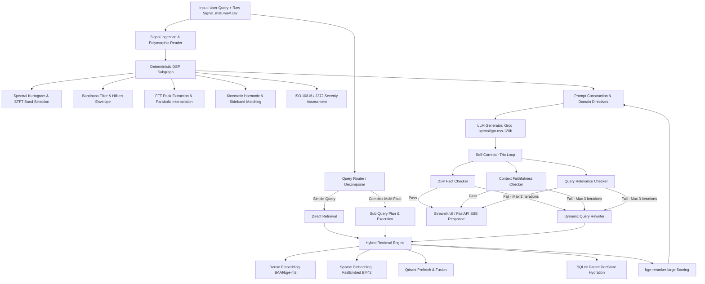
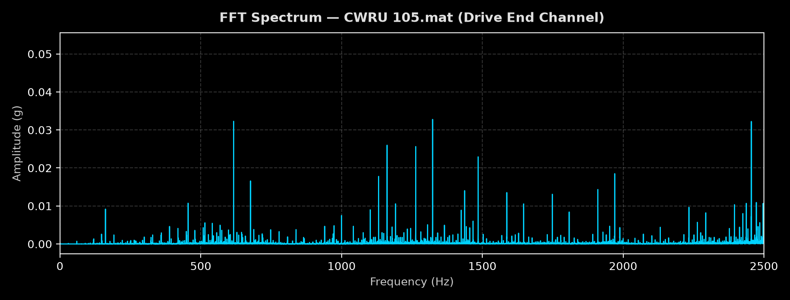
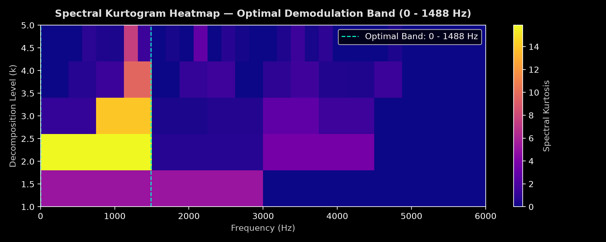
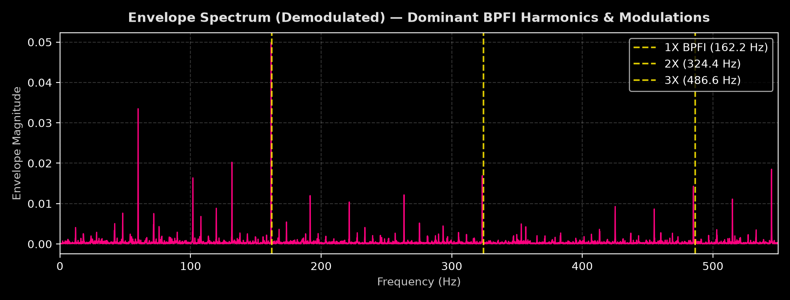
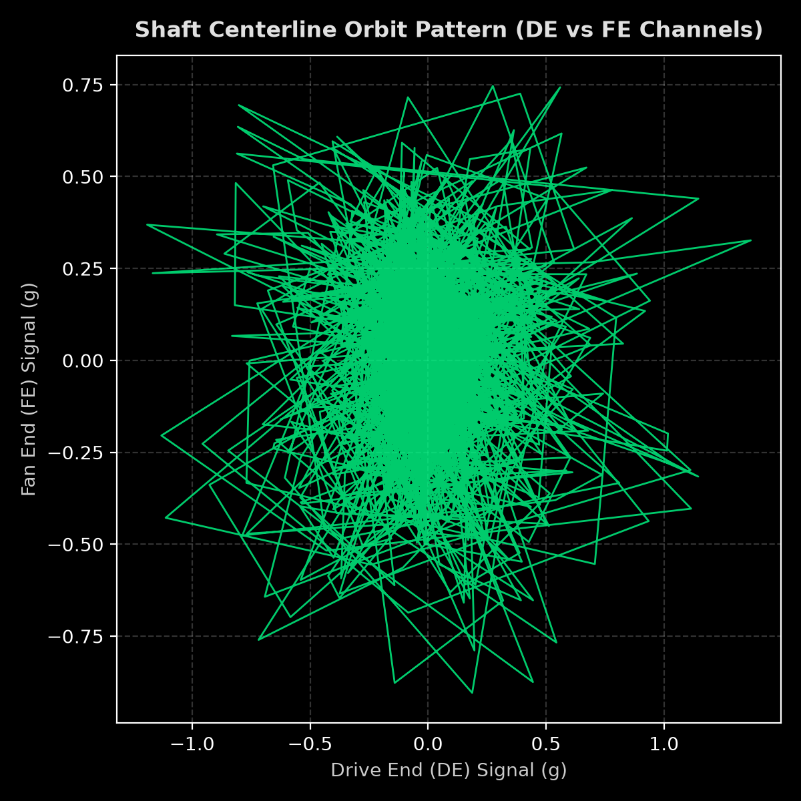

# VibraDiag: Agentic Vibration Analysis and Fault Diagnosis System

<p align="left">
  
  
  
  
  
  
  
  
  
  
</p>

---

## Table of Contents
1. [Project Overview](#1-project-overview)
2. [Problem Definition](#2-problem-definition)
3. [Solution Approach](#3-solution-approach)
4. [Tech Stack](#4-tech-stack)
5. [Project Structure](#5-project-structure)
6. [Environment & Configuration](#6-environment--configuration)
7. [Run Instructions](#7-run-instructions)
8. [Example Input / Output](#8-example-input--output)
9. [Key Features](#9-key-features)
10. [Limitations](#10-limitations)
11. [Future Improvements](#11-future-improvements)
12. [Project Status](#12-project-status)
13. [Repository Workflow](#13-repository-workflow)
14. [Author](#14-author)

---

## 1. Project Overview
**VibraDiag** is an **Agentic RAG and Deterministic Signal Processing Application** designed for industrial predictive maintenance, machinery vibration analysis, and mechanical fault diagnosis.

**Core Objective:** Deliver deterministic industrial vibration fault detection by fusing rigorous Digital Signal Processing (DSP) algorithms with an agentic, self-correcting Retrieval-Augmented Generation (RAG) pipeline governed by international vibration standards (ISO 10816 / ISO 2372 / VDI 2056).

---

## 2. Problem Definition

### Problem
Industrial rotating and reciprocating machinery (turbines, pumps, gearboxes, motors, compressors) generates complex, high-frequency vibration signals. Traditional diagnostic methods depend entirely on specialized vibration analysts manually deciphering FFT spectra, envelope modulations, and kurtograms against dense engineering catalogs. Standard Generative AI and naive RAG systems fail in this domain because LLMs cannot reliably compute mathematical Fourier transforms, detect bearing characteristic defect frequencies, or evaluate multi-harmonic sidebands without severe hallucinations and context degradation.

### Why this problem matters
Unplanned industrial downtime due to catastrophic bearing, gear, or misalignment failures costs manufacturing and energy industries billions of dollars annually. Providing maintenance crews with rapid, high-confidence, standards-compliant diagnoses alongside actionable maintenance work orders prevents catastrophic machinery breakdown, minimizes maintenance turnaround time, and optimizes plant operational efficiency.

### Target user / use case
- **Target Users:** Reliability engineers, condition monitoring specialists, plant maintenance managers, and industrial technicians.
- **Use Cases:**
  - Automated analysis of multi-channel raw sensor recordings (`.mat`, `.wav`, `.csv`).
  - Automated calculation and detection of bearing defect frequencies (BPFO, BPFI, BSF, FTF) and shaft kinematic faults (unbalance, angular/parallel misalignment, mechanical looseness).
  - Multi-standard severity assessment (ISO Zone A/B/C/D) and step-by-step root cause maintenance advisory synthesis.

---

## 3. Solution Approach

VibraDiag operates through an end-to-end multi-stage pipeline:



1. **Digital Signal Processing (DSP):** Deterministic multi-channel vibration signal analysis computing FFT spectra, spectral kurtograms, Hilbert envelope demodulation, parabolic peak interpolation, kinematic defect frequency matching (BPFO, BPFI, BSF, FTF), and ISO 10816 / 2372 / VDI 2056 severity grading with zero hallucination risk.
2. **Data / Document Ingestion:** Multimodal extraction of industrial vibration standards, manufacturer manuals, and vibration engineering textbooks via PyMuPDF text parsing, table geometry recognition, and Gemini 3.5 Flash visual figure extraction.
3. **Preprocessing / Cleaning:** Section-aware hierarchy tagging, noise filtering, ghost-table removal, and bounding-box figure masking.
4. **Chunking:** Two-tier Parent-Child chunking (~1200 token Parent contexts preserved in a relational document store; ~300 token focused Child chunks indexed for search).
5. **Embedding:** Dense semantic embeddings via `BAAI/bge-m3` combined with lexical sparse weights via `FastEmbed BM42` (capturing exact mechanical codes and formulas).
6. **Vector Store:** High-performance Qdrant vector database (collections: `vibra_text_child` and `vibra_visual`) linked with a persistent SQLite Parent DocStore (`docstore.db`).
7. **Query Classification & Decomposition:** Supervised Logistic Regression complexity gating and LLM sub-query decomposer that analyzes user inquiries, routing simple queries directly and decomposing complex multi-fault questions into parallel sub-query retrieval plans with overflow protection.
8. **Retrieval:** Hybrid Reciprocal Rank Fusion (Dense + Sparse) with dynamic prefetching and two-stage cross-encoder re-ranking via `BAAI/bge-reranker-large` (with soft score fallback floors).
9. **Prompt Construction:** Deterministic injection of exact signal processing metrics (RMS, peak-to-peak, crest factor, kurtosis, detected defect frequencies, harmonics, sideband energy, ISO zone classification, and emergency directives for Zone D).
10. **LLM Response Generation:** High-throughput, deep-reasoning industrial diagnostic synthesis with Groq-hosted `openai/gpt-oss-120b` (GPT-OSS-120B), guarded by rigorous formatting and domain directives.
11. **Self-Correction & Verification Loop:** Multi-stage deterministic verification loop (DSP fact-checking, context faithfulness, query relevance) that audits LLM drafts and automatically triggers targeted query reformulations (dictionary expansion, PRF, LLM rewriter) on validation failure.

### Architecture Summary
The system is orchestrated using a stateful LangGraph execution engine. When a signal is uploaded, a deterministic DSP SubGraph processes the data across multiple channels using Hilbert demodulation, fast kurtogram band optimization, and parabolic peak interpolation without any LLM hallucination risk. Concurrently, user inquiries pass through a complexity classifier and query decomposer that routes complex multi-fault questions into specialized sub-queries. The hybrid retrieval engine fetches parent context documents via Qdrant and SQLite, feeds the combined context to an LLM generator, and routes the final draft through a deterministic self-corrector trio (DSP verification, context faithfulness, query relevance) to guarantee factual, standards-compliant industrial diagnostic advice.

---

## 4. Tech Stack

| Component | Choice | Notes |
|:---|:---|:---|
| **Language & Runtime** | Python 3.11 / 3.12 | Managed via `uv` / `pyproject.toml` |
| **Orchestration Framework** | LangGraph & LangChain 0.3.x | Stateful graph workflows, MemorySaver checkpointing |
| **Deterministic DSP** | SciPy 1.15+, NumPy 2.2+ | STFT, Hilbert transform, Fast Kurtogram, Parabolic peak refinement |
| **Vector Database** | Qdrant 1.12+ | Dual-collection hybrid search (Dense + BM42 Sparse) |
| **Parent Document Store** | SQLite (`docstore.db`) | Preserves full ~1200 token parent context for child matches |
| **Dense Embeddings** | `BAAI/bge-m3` | Multilingual, 1024-dimensional dense vector embeddings |
| **Sparse Embeddings** | `FastEmbed BM42` | Term-weighted sparse vectors for exact technical acronyms (BPFO, 1X, 2X) |
| **Cross-Encoder Reranker** | `BAAI/bge-reranker-large` | High-precision re-ranking with dynamic thresholding and score floors |
| **Primary LLM Engine** | Groq (`openai/gpt-oss-120b`) | Ultra-low latency, high-capacity generation with structured domain directives and reasoning parsing |
| **Vision & Extraction LLM** | Google Gemini 3.5 Flash | Multimodal figure understanding and structured table/diagram parsing |
| **API Backend** | FastAPI + Uvicorn + SSE | Asynchronous REST endpoints, Server-Sent Events (SSE) streaming |
| **User Interface** | Streamlit 1.45+ | Interactive diagnostic dashboard with dark industrial theme and Plotly charts |
| **Evaluation & Observability** | Ragas + Custom Evaluators + LangSmith | Deterministic metric assertions, LLM-as-a-judge, full execution tracing |

---

## 5. Project Structure

```text
VibraDiag/
├── config/                          # Application and retrieval YAML configurations
│   ├── app.yaml
│   ├── prompts.yaml
│   └── retrieval.yaml
├── data/
│   ├── decomposer_data/             # Training datasets and domain term lists
│   ├── eval_reports/                # Diagnostic benchmark evaluation reports
│   ├── raw/                         # Raw engineering guidebooks & standards (PDFs)
│   ├── processed/                   # Extracted text/visual JSON chunks
│   └── signal_test/                 # Test vibration signals (CWRU .mat, .wav, .csv)
├── docstore.db                      # SQLite Parent Document Store
├── qdrant_data/                     # Persistent local Qdrant vector database
├── sample_outputs/                  # Exported interactive Plotly HTML diagnostic charts
├── assets/                          # Static PNG charts and diagrams for documentation
├── src/
│   ├── api/                         # FastAPI backend (routers, schemas, services, SSE)
│   ├── deterministic_tools/         # DSP SubGraph, Hilbert transform, Kurtogram, ISO rules
│   ├── evaluation/                  # Ragas & deterministic test benchmarks
│   ├── generation/                  # Prompt builders, Groq / Gemini API client interfaces
│   ├── ingestion/                   # PDF text parser, table extractor, vision pipeline
│   ├── query_decomposer/            # Logistic Regression classifier & LLM sub-query decomposer
│   ├── retrieval/                   # Qdrant client, sparse/dense embedders, reranker, docstore
│   ├── schemas/                     # Pydantic data contracts & LangGraph state definitions
│   ├── self_corrector/              # Trio-checker (DSP, Faithfulness, Relevance) & Rewriter
│   ├── ui/                          # Streamlit application, custom components, Plotly cards
│   ├── config_loader.py             # YAML configuration parser
│   └── main_graph.py                # Main LangGraph compiled workflow
├── pyproject.toml                   # Project dependencies and packaging configuration
├── uv.lock                          # Locked dependency tree
└── README.md                        # Project documentation
```

---

## 6. Environment & Configuration

Create a `.env` file in the project root directory with your API credentials:

```bash
# LLM & Vision Providers
GEMINI_API_KEY=your_gemini_api_key_here
GROQ_API_KEY=your_groq_api_key_here

# LangSmith Observability & Tracing
LANGSMITH_TRACING=true
LANGSMITH_API_KEY=your_langsmith_api_key_here
LANGSMITH_PROJECT=VibraDiag
```

---

## 7. Run Instructions

Follow these step-by-step instructions to set up and launch VibraDiag:

### Step 1: Clone Repository
```bash
git clone https://github.com/furkanfethiesen-source/VibraDiag
cd VibraDiag
```

### Step 2: Install Dependencies
Install dependencies using [uv](https://github.com/astral-sh/uv) (recommended) or standard `pip`:
```bash
# Using uv (fastest)
uv sync

# Or using standard pip virtual environment
python -m venv .venv
source .venv/bin/activate  # On Windows: .venv\Scripts\activate
pip install -e .
```

### Step 3: Configure Environment Variables
```bash
cp .env.example .env  # or edit .env directly with your API keys
```

### Step 4: Build Vector Database
Ingest engineering reference documents and build the hybrid vector database:
```bash
uv run python src/retrieval/build_db.py --force
```

### Step 5: Train / Verify Decomposer Classifier
Train the Logistic Regression query complexity classifier:
```bash
uv run python src/query_decomposer/train_classifier.py
```

### Step 6: Start FastAPI Backend Server
Launch the REST API server:
```bash
uv run uvicorn src.api.main:app --reload --port 8000
```
*API documentation will be available at:* `http://localhost:8000/docs`

### Step 7: Launch Streamlit Dashboard
Open a second terminal window and run:
```bash
uv run streamlit run src/ui/app.py --server.port 8501
```
*Access the web dashboard in your browser at:* `http://localhost:8501`

---

## 8. Example Input / Output

### Example Input
- **Signal File:** Case Western Reserve University (CWRU) 12k Drive End Bearing Dataset (`105.mat`)
- **Operating Parameters:** `1797 RPM`, `fs = 12000 Hz`, `Bearing: 6205-2RS JEM SKF`
- **User Query:** *"Rulmandaki arızanın boyutu nedir ve acil bakım olarak hangi adımlar atılmalıdır?"* *(What is the extent of the bearing fault and what emergency maintenance steps should be taken?)*

---

### Example Output

```markdown
### Fault Extent & Severity Evaluation
Based on the deterministic signal processing results, the machine's vibration overall RMS value is **4.250 mm/s** with a Crest Factor of **5.93**. The elevated Crest Factor indicates impulsive impact vibrations characteristic of raceway and rolling element defects.

The primary fault is conclusively identified as **Ball Pass Frequency Inner Ring (BPFI)** at **162.2 Hz** with a confidence score of **1.00** and a severity score of **21.75**. Secondary modulations and harmonic sidebands (1X running speed sidebands) confirm significant localized inner raceway spalling.

### ISO 10816 / ISO 2372 Standard Severity Zone
The calculated RMS level places the machine in **ISO Zone C (Just Tolerable / Restricted Operation)**:
- **Zone A:** Good (New machine condition)
- **Zone B:** Allowable (Unrestricted long-term operation)
- **Zone C:** Just Tolerable (Restricted operation; fault is actively progressing)
- **Zone D:** Not Permissible (Critical severity; immediate shutdown required)

Zone C indicates that while the machine does not require an instantaneous emergency trip, the defect is actively deteriorating and maintenance intervention must be scheduled promptly during the next planned maintenance window.

### Recommended Maintenance Directives
1. **Accelerated Trend Monitoring:** Increase vibration monitoring frequency to weekly intervals; track envelope demodulation peak growth and 1X rotational sideband side lobes.
2. **Lubrication Inspection:** Check for grease/oil degradation, metal particulate contamination, and excessive operating temperature on the Drive End bearing housing.
3. **Scheduled Replacement:** Order a replacement bearing (`6205-2RS`) and plan bearing replacement during the upcoming planned downtime to avoid catastrophic shaft seizure.
```

---

### Diagnostic Visualizations & Interpretations

#### 1. FFT Spectrum (Drive End Accelerometer)

*Figure 1: Direct FFT Spectrum displaying high-frequency resonance excitation and low-frequency rotational peaks. Direct FFT highlights overall energy distribution and detects general mechanical unbalance / looseness.*

#### 2. Spectral Kurtogram Heatmap

*Figure 2: Spectral Kurtogram Heatmap identifying the optimal filter bandwidth and center frequency ($f_c \approx 3000\text{ Hz}$) where transient impulsive impact energy exhibits maximum spectral kurtosis.*

#### 3. Demodulated Envelope Spectrum (BPFI Detection)

*Figure 3: High-resolution Envelope Spectrum after bandpass filtering and Hilbert transform demodulation. Prominent peaks at $1\times\text{BPFI}$ ($162.2\text{ Hz}$), $2\times\text{BPFI}$ ($324.4\text{ Hz}$), and $3\times\text{BPFI}$ ($486.6\text{ Hz}$) with $1\times\text{RPM}$ sidebands unambiguously prove an Inner Race Defect.*

#### 4. Shaft Centerline Orbit Pattern

*Figure 4: Cross-channel orbit visualization (Drive End vs. Fan End) confirming dynamic shaft trajectory and ruling out severe hydrodynamic journal whirl or catastrophic structural misalignment.*

---

## 9. Key Features
 
- **High-Accuracy DSP Subgraph:** Fully deterministic, multi-channel signal processing engine computing FFT, STFT, Fast Kurtogram, Hilbert Envelope demodulation, ratio matching, and parabolic peak interpolation with zero LLM hallucination risk.
- **Qdrant Hybrid Search & Dynamic Prefetch:** Fusion of dense `BAAI/bge-m3` vectors and `FastEmbed BM42` sparse representations, dynamically expanding retrieval candidates before passing to `BAAI/bge-reranker-large`.
- **Self-Corrector Trio Checker & Rewriter:** Multi-stage deterministic verification loop that audits LLM drafts against DSP fact tables, context faithfulness, and query relevance, automatically triggering targeted query reformulations on failure.
- **Robust Decomposer & Fallback Routing:** Supervised Logistic Regression classifier combined with an LLM sub-query decomposer that breaks down multi-fault industrial scenarios into parallel retrieval plans.
- **Deterministic & LLM-as-a-Judge Evaluation:** Dual evaluation harness combining mathematical metric assertions (Ragas context recall, precision, faithfulness) with domain-specific diagnostic benchmark suites.
- **LangSmith Observability:** Complete end-to-end trace telemetry covering state transitions, token usage, latency bottlenecks, and retriever score distributions.

---

## 10. Limitations

1. **Multi-Channel Dependency for Phase & Misalignment Diagnosis:** While cross-channel relative phase difference analysis (`180° ± 30°` coupling check at 1X/2X/3X) and 2D shaft orbit plots are implemented for multi-channel sensor setups, single-channel signal recordings lack a secondary spatial/tachometer reference. Consequently, single-channel inputs rely solely on spectral harmonic ratios ($1\text{X}/2\text{X}$ amplitudes) and cannot definitively distinguish angular misalignment from pure unbalance without multi-channel phase data.
2. **Linear-Scale Spectral Peak Interpolation:** The 3-point parabolic peak interpolation is implemented on a linear amplitude scale rather than a logarithmic (dB) scale, which limits sub-bin frequency precision for low-amplitude harmonics situated in high-dynamic-range spectra.
3. **Vision LLM Extraction Inconsistencies:** Complex engineering diagrams and charts were converted into structured JSON via a lightweight multimodal model (Gemini 3.5 Flash) instead of dense raw-pixel embedding graphs. Minor extraction discrepancies and occasional parsing inconsistencies may occur in dense catalog layouts, occasionally requiring manual schema validation.
4. **Semantic Retrieval Boundaries on Technical Jargon:** When queries are heavily loaded with domain-specific abbreviations (`BPFO`, `BPFI`, `BSF`, `FTF`, `1X/2X`, `ISO 10816-3 Class I/II`), dense vector spaces can experience semantic drift and loss of context despite hybrid BM25/BM42 sparse integration.
5. **Lightweight SLM/Classifier Routing Trade-offs:** In order to minimize inference latency and compute costs in the MVP, lightweight models and Logistic Regression were selected for query decomposition and gating. Under highly complex, ambiguous multi-fault queries, occasional False Positive (FP) or False Negative (FN) sub-graph routings may occur.
6. **Limited Field Troubleshooting Case Studies in Corpus:** The primary knowledge base consists predominantly of theoretical vibration textbooks, ISO standard specifications, and catalog formulas. It lacks extensive collections of empirical, hands-on industrial root-cause troubleshooting logs and step-by-step repair case studies, which constrains the depth of practical field repair recommendations.

---

## 11. Future Improvements

- **Transient Speed Phase Tracking & Multi-Plane Polarimetry:** Expand beyond steady-state relative phase checks to incorporate automated Bode/Nyquist speed run-up/coast-down tracking and multi-plane dynamic balancing vector polarimetry.
- **Logarithmic (dB) Parabolic Peak Interpolation:** Upgrade the peak refinement algorithm to perform parabolic curve fitting in the logarithmic domain for superior sub-Hz frequency precision.
- **Vision Model Upgrade & Direct Multimodal RAG:** Transition from static JSON parsing to native multimodal image embedding models (e.g., ColPali / Gemini 2.5 Pro) for lossless extraction of complex vibration spectrograms and nomograms.
- **Corpus Expansion with Field Maintenance Case Studies:** Ingest real-world industrial root-cause failure analysis (RCFA) reports and corrective action databases from power plants and manufacturing facilities.
- **Domain-Specific Fine-Tuned Embeddings:** Fine-tune dense embedding encoders on vibration engineering terminology to eliminate semantic retrieval loss on kinematic acronyms.

---

## 12. Project Status
**Status:** `In progress`

---

## 13. Author
- **Name:** Furkan Fethi Esen
